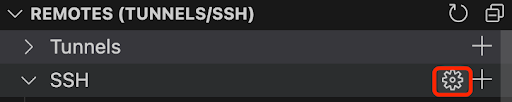
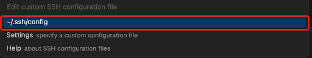
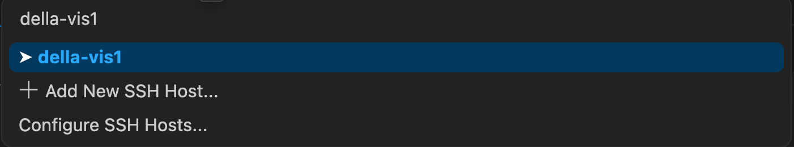
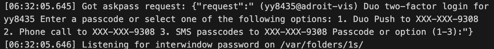
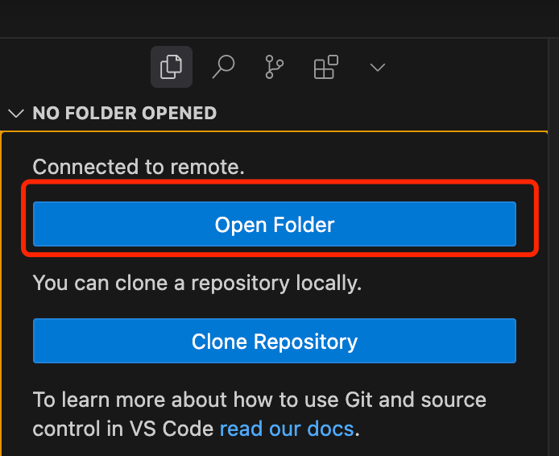

# Campus-wide Cluster Manual

## Configure SSH

We recommend using the remote explorer in Cursor / VSCode to establish SSH connection with the cluster. For Cursor, you can claim a free membership [here](https://www.cursor.com/pricing). Open the SSH configuration under the remote explorer.

<p align="center">

</p>
<p align="center">

</p>
Copy and paste the following into the SSH configuration. Replace `$NetID` with the username for the account (everything before @). For example, if the account is yy8435@princeton.edu, then the NetID should be `yy8435`.  

```
Host della-*
    HostName %h
    ProxyJump della
    User $NetID
    ControlMaster auto
    ControlPersist yes
    ControlPath ~/.ssh/sockets/%p-%h-%r
Host della
    HostName della.princeton.edu
    User $NetID
    ControlMaster auto
    ControlPersist yes
    ControlPath ~/.ssh/sockets/%p-%h-%r
```


## Connect to the Cluster

Open the Command Palette in VSCode with `Ctrl+Shift+P` (or `Command+Shift+P` in Mac). Type `>Remote-SSH:Connect to Host` and press Enter. Then type `della-vis1` in the Command Palette and press Enter.   

Note that if we simply connect to `della` (not the visualization node), the login can only last for a few minutes and will be killed then. Therefore, it is more convenient to develop / edit / debug the codebase on the visualization node.


<p align="center">

</p>
<p align="center">

</p>

It will ask you to type in the password for the account. 
<p align="center">

</p>

Then complete the two-factor authentication step.
<p align="center">

</p>

Check the output of SSH connection to select which two-factor login method. Here 1 is for Duo Push, 2 is for Phone Call, and 3 is for SMS Passcode.
<p align="center">

</p>

Finally click the Open Folder button.

<p align="center">

</p>
It will automatically set the path to the home directory, which should be /home/$NetID.
<p align="center">

</p>

## Submit your First Slurm Job

Below we show a simple example of submitting a slurm job to train a neural network on the MNIST dataset using PyTorch Distributed Data Parallel (DDP).

We first clone this repo and load an existing conda environment `torch-env`.

```bash
git clone https://github.com/davidyyd/Princeton-cluster.git
module purge
module load anaconda3/2023.9
conda activate torch-env
```

Then download the MNIST dataset. 

```bash
python download_data.py
```

Finally use `sbatch` command to submit the job:
```bash
sbatch job_campus.slurm
```

You can check the log file ``slurm-xxxxx.out`` under the root where you run the command. The model should achieve 98% accuracy on the test set in two epochs.

For more details on the above slurm script, check out [here](https://github.com/PrincetonUniversity/multi_gpu_training/tree/main/02_pytorch_ddp)


## Request Interactive Session

Interactive sessions are useful for testing scripts. To start an interactive session on a GPU node, use:

```bash
salloc --nodes=1 --ntasks=1 --time=60:00 --cpus-per-task=8 --mem=32G --gres=gpu:4 --constraint=gpu80
```

Once the session is granted, you will be logged into a compute node with GPU access. You can now run a Python script without `sbatch` command:
```bash
module purge
module load anaconda3/2023.9
conda activate torch-env
CUDA_VISIBLE_DEVICES=0,1,2,3 python -m torch.distributed.run --nproc_per_node=4 mnist_classify_ddp.py --epochs 2
``` 

To exit the interactive session, simply type:

```bash
exit
```

Note you can also use the visualization node to do small-scale testing. Since this is a shared space for all users, any work consuming too many CPU / GPU resources will be killed automatically.
