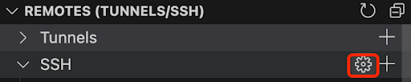
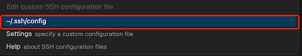

# Department-wide Cluster Manual

## Configure SSH

We recommend using the remote explorer in Cursor / VSCode to establish SSH connection with the cluster. For Cursor, you can claim a free membership [here](https://www.cursor.com/pricing). Open the SSH configuration under the remote explorer.

<p align="center">

</p>
<p align="center">

</p>
Copy and paste the following into the SSH configuration. Replace `$NetID` with the username for the account (everything before @). For example, if the account is yy8435@princeton.edu, then the NetID should be `yy8435`.  

```
Host neuronic
    HostName neuronic.cs.princeton.edu
    User $NetID
    ControlMaster auto
    ControlPersist yes
    ControlPath ~/.ssh/sockets/%p-%h-%r
```


## Connect to the Cluster

Open the Command Palette in VSCode with `Ctrl+Shift+P` (or `Command+Shift+P` in Mac). Type `>Remote-SSH:Connect to Host` and press Enter. Then type `neuronic` in the Command Palette and press Enter.   

<p align="center">

</p>
<p align="center">

</p>

It will ask you to type in the password for the account. 
<p align="center">

</p>

Then complete the two-factor authentication step.
<p align="center">

</p>

Check the output of SSH connection to select which two-factor login method. Here 1 is for Duo Push, 2 is for Phone Call, and 3 is for SMS Passcode.
<p align="center">

</p>

Finally click the Open Folder button.

<p align="center">

</p>
It will automatically set the path to the home directory, which should be /u/$NetID.
<p align="center">

</p>

## Storage Space

There are three types of storage space on the cluster:

- Home space (`/u/$NetID` or `~`): 
  This is the home directory for each user. Since there is only a limit of 16GB, it should be used to store code only.
- Project space (`/n/fs/vision-mix/$NetID`): 
  This is the shared project directory for each user in our lab. It has a total limit of 11TB across all users. You can use it to store your conda environment, model checkpoints, and other large files. Please be considerate with your usage, as this space is shared by everyone. Each user’s directory needs to be created manually. To request a new one, please contact David Yin by [email](yida.yin@princeton.edu) or [messenger](https://www.facebook.com/yida.yin.5?mibextid=wwXIfr&mibextid=wwXIfr) for help.
- Scratch space (`/scratch/$NetID`): 
  This is the shared scratch directory on each node (i.e., not accessible from other nodes). It has a limit of 3.5TB across all users. You can use it to store any temporary files, such as pip install cache and huggingface cache. Note that this space is not backed up and rountinely purged, so you should not store any important files here.


## Submit your First Slurm Job

Below we show a simple example of submitting a slurm job to train a neural network on the MNIST dataset using PyTorch Distributed Data Parallel (DDP).
We first clone this repo and create a conda environment called `torch-env` to install relevant packages.

```bash
git clone https://github.com/davidyyd/Princeton-cluster.git
module purge
module load anaconda3/2024.02
source ~/.bashrc
conda create -n torch-env python=3.12
conda activate torch-env
pip install torch torchvision --index-url https://download.pytorch.org/whl/cu118
```


Download the MNIST dataset. 

```bash
python download_data.py
```

Finally use `sbatch` command to submit the job:
```bash
sbatch job_department.slurm
```

You can check the log file ``slurm-xxxxx.out`` under the root where you run the command. The model should achieve 98% accuracy on the test set in two epochs.

For more details on the above slurm script, check out [here](https://github.com/PrincetonUniversity/multi_gpu_training/tree/main/02_pytorch_ddp)


## Request Interactive Session

Interactive sessions are useful for testing scripts. To start an interactive session on a GPU node, use:

```bash
salloc --nodes=1 --ntasks=1 --time=60:00 --cpus-per-task=8 --mem=32G --gres=gpu:4
```

Once the session is granted, you will be logged into a compute node with GPU access. You can now run a Python script directly without `sbatch` command:
```bash
module purge
module load anaconda3/2024.02
conda activate torch-env
python -m torch.distributed.run --nproc_per_node=4 mnist_classify_ddp.py --epochs 2
``` 

To exit the interactive session, simply type:

```bash
exit
```

Note you can also use the login node to do small-scale testing. Since this is a shared space for all users, any work consuming too many CPU / GPU resources will be killed automatically.

## Helpful Commands (Still in progress)

There are some helpful commands for managing your jobs and files under ```/n/fs/vision-mix/helpful_commands```.
To see the current status of all the nodes in the cluster, you can use the following command:

```bash
bash check_all_nodes.sh
```

It will print out the number of free CPUs, CPU memory usage, and the number of free GPUs for each of 32 nodes.

```bash
neu301     FreeCPUs= 40/104   FreeMem=375.0GiB/503.0GiB   FreeGPUs=1/8
...
neu332     FreeCPUs=  4/104   FreeCPUMem= 23.0GiB/503.0GiB   FreeGPUs=4/8
```